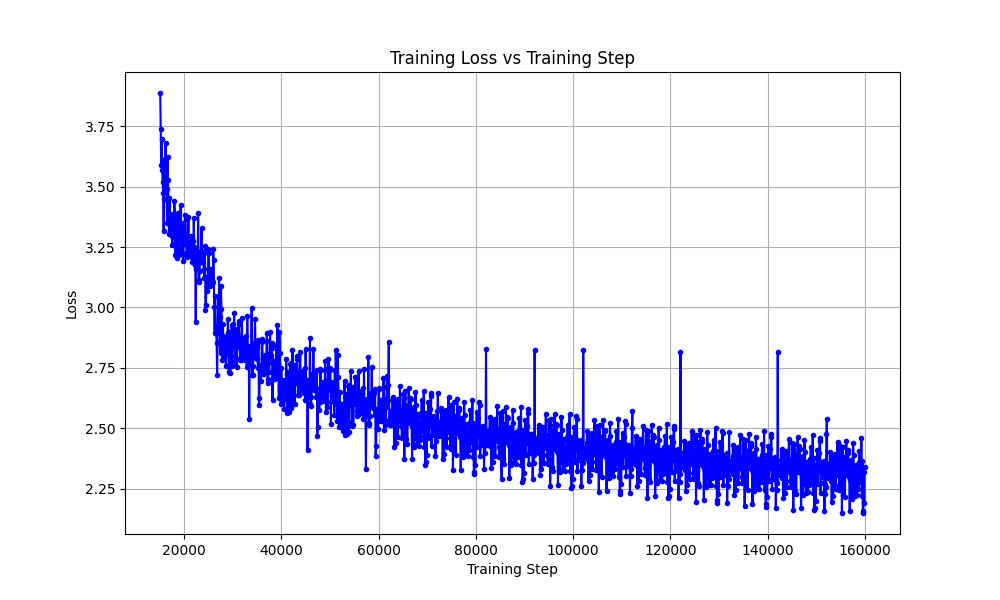

# Argonne LLM

Author: Youzhi Yu

# Argonne 2.0

A **4.9 billion parameter** decoder-only transformer language model trained from scratch using tensor parallelism on a single DGX A100 node.

## Training Loss Curve


The model was trained on **~22 billion tokens** from FineWeb (CC-MAIN-2025-26), achieving a final loss of approximately **2.5–3.5** after 1.35 million training steps.

## Model Architecture

| Component | Specification |
|-----------|--------------|
| **Parameters** | 4,918,072,800 (~4.9B) |
| **Layers** | 24 transformer blocks |
| **Hidden Size** | 4,080 |
| **Attention Heads** | 24 query heads / 8 key-value heads (Grouped-Query Attention) |
| **Head Dimension** | 170 |
| **Feed-Forward** | SwiGLU MLP (~10,880 intermediate dim) |
| **Context Length** | 4,096 tokens |
| **Vocabulary Size** | 151,665 (Qwen2.5-3B-Instruct tokenizer) |
| **Normalization** | RMSNorm (ε = 1e-6) |
| **Position Encoding** | Rotary Position Embeddings (RoPE) |
| **Precision** | bfloat16 mixed precision |

### Key Architectural Features

- **Grouped-Query Attention (GQA)**: Uses 24 query heads with 8 key-value heads (3:1 ratio), reducing memory bandwidth requirements while maintaining model quality.
- **SwiGLU Activation**: Employs the SwiGLU activation function in the MLP layers for improved training dynamics.
- **Flash Attention**: Leverages PyTorch's `scaled_dot_product_attention` for efficient attention computation on Ampere/Hopper GPUs.
- **RoPE**: Rotary position embeddings enable better length generalization compared to absolute positional encodings.

## Training Details

### Hardware Configuration

- **Node**: 1× DGX A100 (8× NVIDIA A100 80GB GPUs)
- **Parallelism**: Tensor parallelism across 8 GPUs
- **Interconnect**: NVLink for high-bandwidth GPU-to-GPU communication

### Training Hyperparameters

| Parameter | Value |
|-----------|-------|
| **Total Training Steps** | 1,347,890 |
| **Tokens Processed** | ~21.9 billion |
| **Micro-batch Size** | 2–4 per GPU |
| **Gradient Accumulation** | 4 steps |
| **Effective Batch Size** | ~64–128 sequences |
| **Learning Rate** | 1e-4 (peak) → 1e-5 (cosine decay) |
| **Warmup Steps** | 2,000 |
| **Weight Decay** | 0.1 |
| **Gradient Clipping** | 1.0 |
| **Optimizer** | AdamW (fused) |

### Training Data

The model was trained on **Common Crawl CC-MAIN-2025-26** data:
- 250 Parquet shards streamed sequentially
- Documents tokenized with BOS/EOS boundary markers
- Aggressive filtering of low-quality content (high digit ratio, low alpha ratio)
- Chunked into 4,096-token sequences

### Tensor Parallelism Implementation

The training uses a custom tensor parallel implementation (`TensorParallelModel`) that:
- **Shards attention projections**: Q/K/V/O projections are split across GPUs
- **Shards MLP layers**: Gate, up, and down projections distributed across GPUs
- **Replicates embeddings and norms**: Token embeddings and layer norms remain replicated for simplicity
- **Async all-reduce**: Uses asynchronous collective operations for overlapping communication with computation

Each GPU holds 1/8th of the attention heads (3 Q heads, 1 KV head per GPU) and 1/8th of the MLP hidden dimension.

### Checkpointing

- Checkpoints saved every ~430 steps
- Per-block gradient checkpointing enabled to reduce memory footprint
- Automatic pruning of old checkpoints (keeps last 50)
- Resumable training with exact data position tracking

## Training Progress

### Loss Progression

| Milestone | Steps | Tokens | Loss |
|-----------|-------|--------|------|
| Start | 0 | 0 | ~9.3 |
| 1K steps | 1,000 | 16M | ~6.5 |
| 10K steps | 10,000 | 164M | ~5.5 |
| 100K steps | 100,000 | 1.6B | ~4.0 |
| 500K steps | 500,000 | 8.2B | ~3.5 |
| 1M steps | 1,000,000 | 16.4B | ~3.0 |
| Final | 1,347,890 | 21.9B | ~2.5–3.5 |

### Sample Generations

**At step 1,347,190:**
> "Long long time ago, 5,000 years ago, I have been told it is more than 10,000 times. It is not the same as the 10,000 years ago. You just have to have a very good reason for believing that you are a good person and that you are good..."

The model demonstrates emergent capabilities in generating coherent English text, though quality varies with the inherent noise of web-scale pretraining data.

## Repository Structure

```
ArgonneAI/
├── model.py                    # Model architecture (ArgonneConfig, ArgonneModel)
├── training.py                 # Fresh training with tensor parallelism
├── resume_pretrain_tensor.py   # Resume training from checkpoints
├── data_processing.py          # Tokenization and data loading utilities
├── training_utils.py           # Schedulers, checkpoint utilities
├── inference.py                # Inference utilities
├── model-distillation.py       # Knowledge distillation experiments
├── IMPLEMENTATION_NOTES.md     # Architectural decisions
├── TENSOR_PARALLEL_FIX.md      # Debugging notes for TP issues
└── TENSOR_PARALLEL_USAGE.md    # TP launch instructions
```

## Argonne 1.5

### 🤗 Hugging Face Model

The pretrained model weights and detailed model card are available on Hugging Face:

[👉 https://huggingface.co/PursuitOfDataScience/Argonne-1.5](https://huggingface.co/PursuitOfDataScience/Argonne-1.5)


### Improvements

Compared to Argonne-1.0 pretraining, significant amount of changes were made to improve the model pretraining phase, listed below:

- `torch.compile()` used to boost up pretraining speed
- flash attention implemented to gain additional 2.6x times memeory efficiency, 
translated by training batch size
- More layers and attention heads for the model
- GPU hardware harnessed much more efficiently
- Integrated to Hugging Face AutoModel class for ease of usage
- More support for text generation

### Data

The same as Argonne-1.0. Total processed tokens: 15,453,927,424.


### Model

The model has 356,516,640 parameters in total with the following parameters:

```
block_size = 2048
n_layer = 16
n_head = 16
n_embd = 1296
batch_size = 756
```


### Training

We trained the model on one DGX node with 8× A100 GPUs (80 GB HBM each).

- Total training cost: **1248 GPU hours**.
- Total training steps: **80,000 global steps**

Below is the training loss curve over time:


### Inference

```
from transformers import AutoModelForCausalLM, AutoTokenizer
import torch

model_path = "PursuitOfDataScience/Argonne-1.5"

# 1) Load the custom Argonne model with trust_remote_code=True
model = AutoModelForCausalLM.from_pretrained(
    model_path,
    trust_remote_code=True
)

# 2) Load the tokenizer
tokenizer = AutoTokenizer.from_pretrained(model_path)

# 3) Inference
prompt = "The meaning of life is "
inputs = tokenizer(prompt, return_tensors="pt")

# call generate with typical HF params
outputs = model.generate(**inputs, max_length=150, do_sample=True, top_k=50, top_p=0.95, temperature=0.7)
print(tokenizer.decode(outputs[0], skip_special_tokens=True))
```

Sample generation text:

<pre>
The meaning of life is tamed in many ways. It is a state of mental and physical development. It is a state of deep emotional strength and confidence, and it is a state of physical and mental balance. In this article, we will explore the meaning of life, the different ways life is defined, and how we can apply this concept to our own lives.
</pre>


## Argonne 1.0

### 🤗 Hugging Face Model

The pretrained model weights and detailed model card are available on Hugging Face:

[👉 https://huggingface.co/PursuitOfDataScience/Argonne-1.0](https://huggingface.co/PursuitOfDataScience/Argonne-1.0)


### Data

We use Fineweb-Edu (CC-MAIN-2024-10) for model pretraining. This dataset is hosted on Hugging Face: [Fineweb-Edu on Hugging Face](https://huggingface.co/datasets/HuggingFaceFW/fineweb-edu)).

### Model
The model has 275,827,680 parameters in total with the following parameters:

```
block_size = 2048
n_layer = 12
n_head = 12
n_embd = 1296
dropout = 0.1
```
The learning rate (LR) was initially set to 3e-5 until step 62,000, after which it was increased to 5e-5. Correspondingly, the batch size was increased from 48 to 60 at the same step.

### Training

We trained the model on a single DGX node with 8× A100 GPUs (80 GB HBM each).

- Total training cost: **1440 GPU hours**.
- Total training steps: **160,000 global steps**

Below is the training loss curve over time:



### Repository Scripts

The repository contains the following key scripts:

- **mp_pretrain.py**: Core pretraining script with model-parallel training architecture
- **inference.py**: Clean inference script for generating text with the trained model
- **convert_model.py**: Utility to convert a pipeline-parallel model to single-GPU format
- **instruct_finetuning.py**: Fine-tuning script for instruction-based learning on a single GPU
- **run_instruct_finetuning.sh**: PBS batch script to run distributed fine-tuning

### Inference

Please refer to (🤗 Model Card)[https://huggingface.co/PursuitOfDataScience/Argonne-1.0#inference] for details.

Below is an example of text generated by our pre-trained LLM using some typical prompts:

<pre>
The meaning of life is tantamount to an inescapable reality. It can be seen as an inescapable reality where life is lived in a vacuum, or a mere absence of life. Life can be considered as the ultimate reality, where life is no more, where life has no purpose, and life has no meaning.
Life is a form of art, rather than a mere collection or an endless expanse. It is a realm where art, music, philosophy, philosophy, and science come together to create something new, beautiful, and meaningful. It is the boundlessness of existence that creates the essence of art, music, philosophy and science.
So, what does a life mean? It means something
</pre>

<pre>
In the future, artificial intelligence will tame the need for new ways to understand and control our lives. AI is already being used to do tasks that previously took human intelligence. But is it possible to predict what will come in the future, what will happen in the future, and how much will we be willing to pay for AI?
Evolutionary scientists have been developing new technologies that can be used to create artificial intelligence. For example, AI algorithms can be used to detect objects in a scene. These algorithms have been used in the design and manufacturing of many different products.
Similarly, AI algorithms can be used to predict the future by analyzing historical data and patterns in it. This information can be used to predict the future and make predictions accordingly.
</pre>

