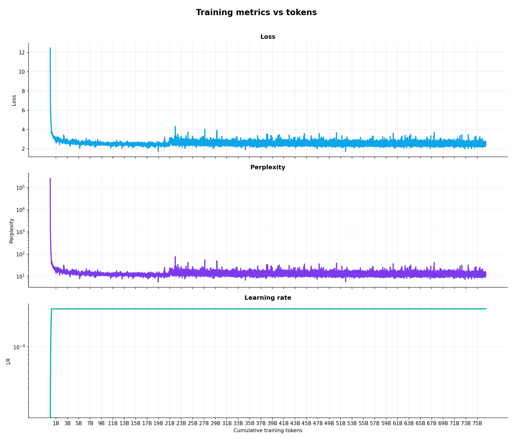
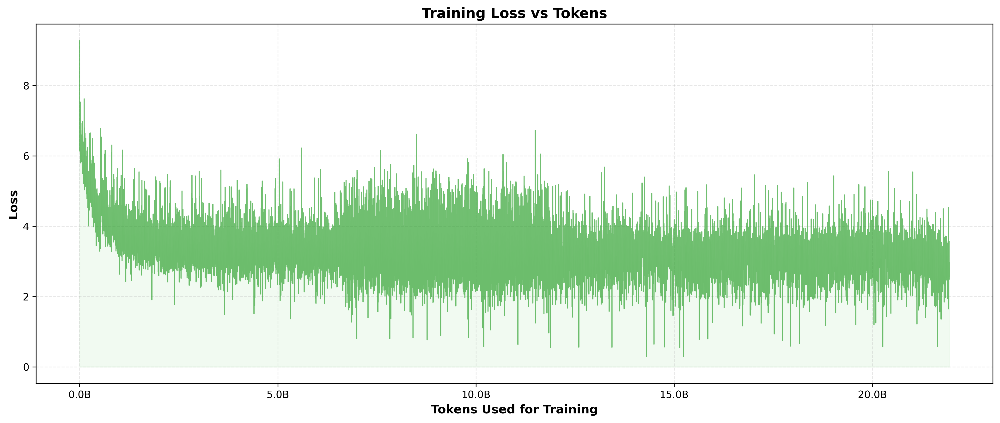

# Argonne LLM Family

Author: Youzhi Yu

Training pipeline and release history for the Argonne causal LM family, trained from scratch on FineWeb-derived web text.

| Model | Params | Context | Training tokens | Hugging Face |
|-------|--------|---------|-----------------|--------------|
| [Argonne 3.0](#argonne-30) | 2.88B | 1,024 (RoPE θ=1e6) | ~76.05B | [argonne-3.0-base](https://huggingface.co/PursuitOfDataScience/argonne-3.0-base) |
| [Argonne 2.5](#argonne-25) | 1.27B | 1,024 | ~76.05B | [Argonne2.5-base](https://huggingface.co/PursuitOfDataScience/Argonne2.5-base) |
| [Argonne 2.0](#argonne-20) | 4.9B | 4,096 | ~21.9B | — (not released) |
| [Argonne 1.5](#argonne-15) | 357M | 2,048 | ~15.45B | [Argonne-1.5](https://huggingface.co/PursuitOfDataScience/Argonne-1.5) |
| [Argonne 1.0](#argonne-10) | 276M | 2,048 | FineWeb-Edu | [Argonne-1.0](https://huggingface.co/PursuitOfDataScience/Argonne-1.0) |

---

# Argonne 3.0

Argonne 3.0-base is a 2.88B-parameter decoder-only transformer, released as [`PursuitOfDataScience/argonne-3.0-base`](https://huggingface.co/PursuitOfDataScience/argonne-3.0-base). It combines grouped-query attention with stability-oriented additions: QK-norm, V-norm, sandwich norms, interleaved local/global attention, and a final logit softcap.

## Training loss curve



## Model architecture

| Component | Specification |
|-----------|---------------|
| **Parameters** | 2,882,162,688 (~2.88B) |
| **Layers** | 24 transformer blocks |
| **Hidden size** | 3,072 |
| **Attention heads** | 12 query / 4 key-value (GQA) |
| **Head dimension** | 256 |
| **Feed-forward** | SwiGLU MLP, 8,192 intermediate dim |
| **Attention pattern** | Interleaved local/global causal attention (window 256, every other layer) |
| **Normalization** | RMSNorm with QK / V / sandwich norms |
| **Position encoding** | RoPE (θ = 1,000,000) |
| **Logit stabilization** | Final logit softcap = 15.0 |
| **Context length** | 1,024 tokens |
| **Vocabulary size** | 151,669 (Qwen3 tokenizer) |
| **Tied embeddings** | Yes (input ↔ output) |

## Training details

| Item | Value |
|------|-------|
| **Stages** | Pretrain (`pretrain.py`) → continued pretrain (`continue_pretrain.py`) |
| **Total optimizer steps** | 329,148 |
| **Tokens processed** | ~76.05B (20.84B stage 1 + 55.21B stage 2, one epoch each) |
| **Sequence length** | 1,024 |
| **Effective batch** | 233,472 tokens/step (38 per GPU × grad accum 2 × 3 GPUs) |
| **Peak learning rate** | 3e-4, WSD schedule, 1,000 warmup steps, min LR ratio 0.1 |
| **Optimizer** | AdamW (β₁=0.9, β₂=0.95, weight decay 0.1), grad clip 1.0 |
| **Precision** | bf16 autocast, `torch.compile`, gradient checkpointing |
| **Final train loss** | 2.5168 |
| **Hardware** | 3× NVIDIA H200 (DDP) |

## Training data

- Stage 1: FineWeb shard (~20.84B tokens)
- Stage 2: FineWeb CC-MAIN-2025-21 dump (~55.21B tokens)
- Tokenizer: [Qwen/Qwen3-0.6B-Base](https://huggingface.co/Qwen/Qwen3-0.6B-Base) (151,669-token vocab)

---

# Argonne 2.5

Argonne 2.5 is a 1.27B-parameter pretraining checkpoint, released as [`PursuitOfDataScience/Argonne2.5-base`](https://huggingface.co/PursuitOfDataScience/Argonne2.5-base).

## Training loss curve


## Model architecture

| Component | Specification |
|-----------|--------------|
| **Parameters** | 1,273,807,360 (~1.27B) |
| **Layers** | 28 transformer blocks |
| **Hidden size** | 1,792 |
| **Attention heads** | 14 query / 7 key-value (GQA) |
| **Head dimension** | 128 |
| **Feed-forward** | SwiGLU MLP, 4,864 intermediate dim |
| **Context length** | 1,024 tokens |
| **Vocabulary size** | 151,669 |
| **Normalization** | RMSNorm (ε = 1e-6) |
| **Position encoding** | RoPE (θ = 10,000) |

## Training details

| Item | Value |
|------|-------|
| **Total steps** | 425,975 |
| **Tokens processed** | ~76.05B |
| **Final train loss** | 2.6119 |
| **Sequence length** | 1,024 |
| **Effective batch** | 245,760 tokens (20 per GPU × grad accum 4 × 3 GPUs) |
| **Learning rate** | 3e-4, min LR ratio 0.1, 1,000 warmup steps |
| **Precision** | bf16 autocast, `torch.compile` |
| **Hardware** | 3× H200 (DDP) |

## Training data

- FineWeb and FineWeb-Edu
- Final stage training shard: 55.2B tokens; cumulative across the full run: 76.05B tokens

---

# Argonne 2.0

A 4.9B-parameter decoder-only transformer trained from scratch with a custom tensor-parallel implementation on a single DGX A100 node. Not released on Hugging Face.

## Training loss curve



## Model architecture

| Component | Specification |
|-----------|--------------|
| **Parameters** | 4,918,072,800 (~4.9B) |
| **Layers** | 24 transformer blocks |
| **Hidden size** | 4,080 |
| **Attention heads** | 24 query / 8 key-value (GQA) |
| **Head dimension** | 170 |
| **Feed-forward** | SwiGLU MLP, ~10,880 intermediate dim |
| **Context length** | 4,096 tokens |
| **Vocabulary size** | 151,665 (Qwen2.5-3B-Instruct tokenizer) |
| **Normalization** | RMSNorm (ε = 1e-6) |
| **Position encoding** | RoPE |

## Training details

| Item | Value |
|------|-------|
| **Total steps** | 1,347,890 |
| **Tokens processed** | ~21.9B |
| **Final loss** | ~2.5–3.5 |
| **Learning rate** | 1e-4 peak → 1e-5 (cosine), 2,000 warmup steps |
| **Optimizer** | AdamW (fused), weight decay 0.1, grad clip 1.0 |
| **Parallelism** | Tensor parallelism across 8 GPUs (sharded attention + MLP, replicated embeddings/norms, async all-reduce) |
| **Hardware** | 1× DGX A100 (8× A100 80GB, NVLink) |

## Training data

FineWeb (CC-MAIN-2025-26): 250 parquet shards streamed sequentially, documents tokenized with BOS/EOS boundaries, quality-filtered, chunked into 4,096-token sequences.

---

# Argonne 1.5

A 357M-parameter model, released as [`PursuitOfDataScience/Argonne-1.5`](https://huggingface.co/PursuitOfDataScience/Argonne-1.5).

## Training loss curve


## Improvements over Argonne 1.0

- `torch.compile` for pretraining speed; flash attention for ~2.6× memory efficiency (larger batches)
- More layers and attention heads; more efficient GPU utilization
- Integrated with the Hugging Face `AutoModel` class; better text-generation support

## Model and training

| Item | Value |
|------|-------|
| **Parameters** | 356,516,640 (~357M) |
| **Config** | 16 layers, 16 heads, 1,296 hidden, 2,048 context |
| **Tokens processed** | 15,453,927,424 (~15.45B, same data as 1.0) |
| **Total steps** | 80,000 |
| **Batch size** | 756 |
| **Training cost** | 1,248 GPU hours on 1 DGX node (8× A100 80GB) |

---

# Argonne 1.0

The first Argonne model: 276M parameters, released as [`PursuitOfDataScience/Argonne-1.0`](https://huggingface.co/PursuitOfDataScience/Argonne-1.0). See the [model card](https://huggingface.co/PursuitOfDataScience/Argonne-1.0#inference) for inference details.

## Training loss curve


## Model and training

| Item | Value |
|------|-------|
| **Parameters** | 275,827,680 (~276M) |
| **Config** | 12 layers, 12 heads, 1,296 hidden, 2,048 context, dropout 0.1 |
| **Data** | [FineWeb-Edu (CC-MAIN-2024-10)](https://huggingface.co/datasets/HuggingFaceFW/fineweb-edu) |
| **Learning rate** | 3e-5 until step 62,000, then 5e-5 (batch 48 → 60 at the same step) |
| **Total steps** | 160,000 |
| **Training cost** | 1,440 GPU hours on 1 DGX node (8× A100 80GB) |

---

# Argonne LLM Training

Distributed PyTorch training pipeline for the Argonne causal LM using Qwen-family tokenizers and llm.c-style binary token data.

## Pipeline stages

```text
preprocess_data.py        parquet -> train.bin token shards
pretrain.py               stage 1: DDP pretraining from scratch
continue_pretrain.py      stage 2: continued pretraining on new data
midtraining.py            stage 3: long-context midtraining (FSDP/DDP, e.g. 13,568 ctx)
sft.py                    stage 4: supervised fine-tuning (chat data, e.g. UltraChat)
dpo.py                    stage 5: direct preference optimization
cot-sft.py                stage 6: chain-of-thought SFT (reasoning / <think> models)
```

## Project layout

```text
ArgonneAI/
├── model.py                 # ArgonneModel/ArgonneConfig + HF registration (model_type="argonne2")
├── pretrain.py              # Main DDP pretraining script
├── continue_pretrain.py     # Continued pretraining (new-data continuation)
├── midtraining.py           # Long-context midtraining (FSDP support)
├── sft.py                   # Supervised fine-tuning
├── dpo.py                   # DPO preference tuning
├── cot-sft.py               # Chain-of-thought SFT (HF Trainer-based)
├── preprocess_data.py       # Parquet -> train.bin converter
├── inference.py             # Text generation from a checkpoint or HF repo
├── push_model_to_hf.py      # Publish checkpoints to Hugging Face
└── eval_sft_quality.py      # SFT quality probes
```

## Checkpointing and outputs

- Checkpoints are written as `checkpoint_step_<N>.pt`, including model/optimizer/scheduler state, `global_step`, `tokens_processed`, and data position.
- On periodic checkpoints, rank 0 prints a sampled generation.
- At end of run, scripts save a final checkpoint plus `final_model/` (weights, tokenizer, config via `save_pretrained`).
- Wall-clock-aware training (`--wall_time`) saves and exits cleanly before SLURM time limits, enabling auto-resubmit slice chains.

## Model notes (`model.py`)

- Hugging Face-compatible (`ArgonneConfig`, `ArgonneModel`), registered for `AutoConfig`, `AutoModel`, and `AutoModelForCausalLM`; `from_pretrained` self-heals rotary buffers and the embedding tie after loading.
- GQA, SwiGLU MLP, RMSNorm (+ QK/V/sandwich norms), RoPE, interleaved local/global attention, final logit softcap.
- Attention path selection: FlashAttention 2 (if available) → PyTorch SDPA → math fallback; the active path is logged once at startup.
- Training preset used by `pretrain.py` / `continue_pretrain.py` (Argonne 3 architecture): hidden size 3,072, 24 layers, 12 query heads, 4 KV heads, `max_position_embeddings = --block_size`.
