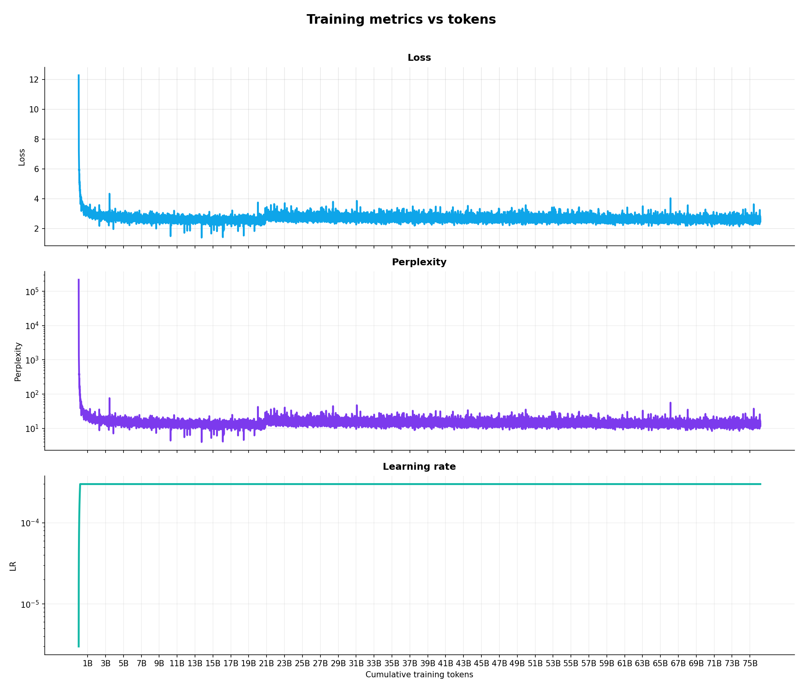

# Argonne 2.5

Argonne 2.5 is the completed pretraining checkpoint for the Argonne causal LM, released as `PursuitOfDataScience/Argonne2.5-base`.

## Training loss curve



## Model architecture

| Component | Specification |
|-----------|--------------|
| **Parameters** | 1,273,807,360 (~1.27B) |
| **Layers** | 28 transformer blocks |
| **Hidden size** | 1,792 |
| **Attention heads** | 14 query / 7 key-value (GQA) |
| **Head dimension** | 128 |
| **Feed-forward** | SwiGLU MLP, 4,864 intermediate dim |
| **Context length** | 1,024 tokens |
| **Vocabulary size** | 151,669 |
| **Normalization** | RMSNorm (ε = 1e-6) |
| **Position encoding** | RoPE (θ = 10,000) |

## Training details

| Item | Value |
|------|-------|
| **Total steps** | 425,975 |
| **Tokens processed** | ~76.05B |
| **Final train loss** | 2.6119 |
| **Sequence length** | 1,024 |
| **Batch size per GPU** | 20 |
| **Gradient accumulation** | 4 |
| **Effective batch** | 245,760 tokens |
| **Learning rate** | 3e-4 |
| **Min LR ratio** | 0.1 |
| **Warmup** | 0 steps |
| **Precision** | bf16 autocast |
| **torch.compile** | Enabled |
| **GPUs** | 3 (DDP) |

## Training data

- FineWeb
- FineWeb-Edu
- Final stage training shard: 55.2B tokens
- Cumulative training across the full run: 76.05B tokens

## Inference

```python
from transformers import AutoModelForCausalLM, AutoTokenizer
import torch

model_id = "PursuitOfDataScience/Argonne2.5-base"

tokenizer = AutoTokenizer.from_pretrained(model_id, trust_remote_code=True)
model = AutoModelForCausalLM.from_pretrained(
    model_id,
    trust_remote_code=True,
    dtype=torch.bfloat16,
)

prompt = "Write a short paragraph about scientific computing at Argonne National Laboratory."
inputs = tokenizer(prompt, return_tensors="pt")
input_ids = inputs["input_ids"].to(model.device)

output_ids = model.generate(
    input_ids,
    max_length=input_ids.shape[1] + 128,
    temperature=0.8,
    top_p=0.95,
    top_k=50,
    do_sample=True,
)
print(tokenizer.decode(output_ids[0], skip_special_tokens=True))
```

---

# Argonne LLM Training

Distributed PyTorch training pipeline for the Argonne causal LM using Qwen-family tokenizers and llm.c-style binary token data.

## Project Layout

```text
ArgonneAI/
├── model.py                 # Argonne model + Hugging Face registration (model_type="argonne2")
├── pretrain.py              # Main DDP pretraining script
├── continue_pretrain.py     # Continued pretraining script (new-data continuation workflow)
├── sft.py                   # Supervised fine-tuning script
├── cot-sft.py               # Chain-of-thought SFT script
├── preprocess_data.py       # Parquet -> train.bin converter
└── test/                    # Experiment scripts/results
```

## Requirements

- Python 3 with CUDA-enabled PyTorch
- `transformers`
- `numpy`
- `pyarrow`
- `tqdm`
- Optional but recommended: `flash-attn` (falls back automatically when unavailable)

## Quick Start

### 1) Preprocess parquet data

Creates `train.bin` with the expected magic/header format and saves a tokenizer copy in `<output_dir>/tokenizer`.

```bash
python3 preprocess_data.py \
  --tokenizer_path /path/to/Qwen3-0.6B-Base \
  --data_dir /path/to/parquet_dir \
  --output_dir /path/to/output_dir \
  --text_column text \
  --workers 16
```

SLURM example:

```bash
sbatch preprocess_job.sh
```

### 2) Train (new run or resume)

`pretrain.py` auto-resumes from the latest `checkpoint_step_*.pt` in `--checkpoint_dir` when `--resume_from` is not provided.

```bash
torchrun --nproc_per_node=2 pretrain.py \
  --tokenizer_path /path/to/tokenizer \
  --data_path /path/to/train.bin \
  --checkpoint_dir /path/to/checkpoints \
  --lr 3e-4 \
  --batch_size 20 \
  --total_batch_size 163840 \
  --block_size 1024 \
  --precision bf16 \
  --flash_attention 1 \
  --torch_compile 1 \
  --gradient_checkpointing 1
```

SLURM example:

```bash
sbatch run_full_training.sh
```

### 3) Continue pretraining on new data

`continue_pretrain.py` is intended for continued pretraining and is commonly used with `--reset_schedule 1`.

```bash
torchrun --nproc_per_node=2 continue_pretrain.py \
  --tokenizer_path /path/to/tokenizer \
  --data_path /path/to/new_train.bin \
  --checkpoint_dir /path/to/checkpoints \
  --lr 3e-4 \
  --batch_size 16 \
  --total_batch_size 131072 \
  --block_size 1024 \
  --reset_schedule 1
```

SLURM example:

```bash
sbatch continue.sh
```

## Common Training Arguments (`pretrain.py` and `continue_pretrain.py`)

| Argument | Description | Default |
|---|---|---|
| `--tokenizer_path` | Path to tokenizer | Required |
| `--data_path` | Path to training tokens (`.bin`) | Required |
| `--checkpoint_dir` | Checkpoint/model output directory | Required |
| `--lr` | Learning rate | Required |
| `--batch_size` | Micro-batch size per GPU | Required |
| `--total_batch_size` | Target total batch size in tokens | Required |
| `--block_size` | Sequence length | Required |
| `--min_lr_ratio` | Final/min LR as a ratio of `--lr` | `0.1` |
| `--warmup_steps` | Warmup steps | `0` |
| `--weight_decay` | AdamW weight decay | `0.1` |
| `--adam_beta1` | AdamW beta1 | `0.9` |
| `--adam_beta2` | AdamW beta2 | `0.95` |
| `--schedule` | LR schedule (`cosine` or `wsd`) | `wsd` |
| `--cooldown` | WSD cooldown steps at end | `0` |
| `--grad_clip` | Gradient norm clipping | `1.0` |
| `--precision` | Autocast precision (`fp32`, `fp16`, `bf16`) | `bf16` |
| `--flash_attention` | Enable flash-attention paths (`0/1`) | `1` |
| `--checkpoint_interval` | Periodic checkpoint interval (seconds) | `1800` |
| `--max_epochs` | Stop after this many data epochs | `1` |
| `--gradient_checkpointing` | Enable gradient checkpointing (`0/1`) | `1` |
| `--torch_compile` | Enable `torch.compile` (`0/1`) | `0` |
| `--torch_compile_mode` | Compile mode (`default`, `reduce-overhead`, `max-autotune`) | `default` |
| `--resume_from` | Explicit checkpoint path | `None` |
| `--wall_time` | If `>0`, save and exit ~3 minutes before limit (seconds) | `0` (disabled) |
| `--reset_schedule` | Reset behavior on resume (see below) | `0` |
| `--val_data_path` | Optional held-out validation `.bin` | `None` |

### Important `--reset_schedule` difference

- In `pretrain.py`, `--reset_schedule 1` resets LR schedule, step counter, token counter, and data position (fresh-run counters).
- In `continue_pretrain.py`, `--reset_schedule 1` resets optimizer/scheduler and data position, but preserves cumulative `global_step` and `tokens_processed` from the loaded checkpoint.

## Checkpointing and Outputs

- Checkpoints are written as `checkpoint_step_<N>.pt`.
- Checkpoints include: model state, optimizer state, scheduler state, `global_step`, `tokens_processed`, and data position.
- On periodic checkpoints, rank 0 also prints a sampled generation.
- At end of run, scripts save:
  - Final training checkpoint
  - `final_model/` containing model weights, tokenizer, and config via `save_pretrained`.

## Model Notes (`model.py`)

- Hugging Face-compatible model/config (`ArgonneConfig`, `ArgonneModel`), registered for `AutoConfig`, `AutoModel`, and `AutoModelForCausalLM`.
- Uses grouped-query attention (GQA), SwiGLU MLP, RMSNorm, RoPE.
- Attention path selection: FlashAttention 2 (if available) -> PyTorch SDPA -> math fallback.
- Includes numerical-stability guards for NaNs/Infs in logits/loss.

### Training preset used by scripts

`pretrain.py` and `continue_pretrain.py` instantiate the model with:

- Hidden size: `1792`
- Layers: `28`
- Attention heads: `14`
- KV heads: `7`
- `max_position_embeddings = --block_size`

The defaults inside `ArgonneConfig` are different and are mainly for config-level compatibility.
