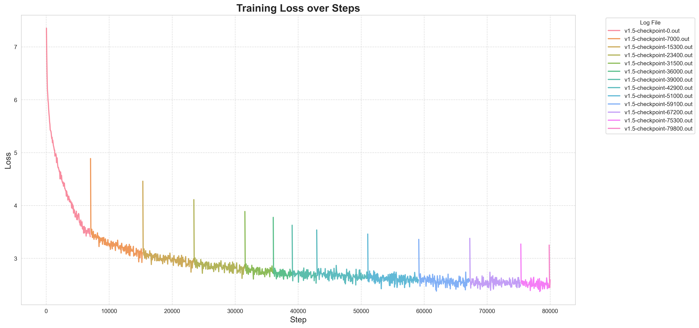
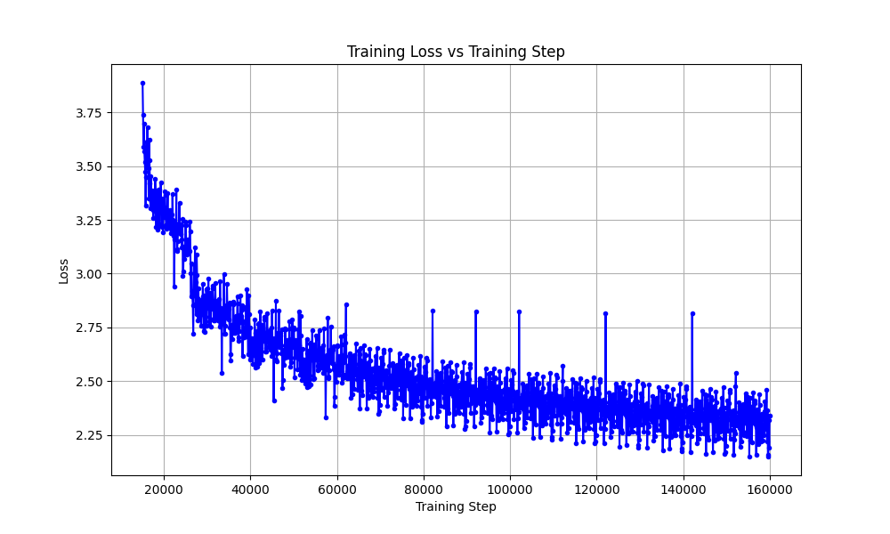

# Argonne LLM

Author: Youzhi Yu

---

# Argonne 2.5

A **~1 billion parameter** decoder-only transformer language model trained from scratch using **hybrid tensor parallelism + data parallelism** across multiple DGX A100 nodes, featuring **sequence packing** for zero-waste training and the **Qwen3-0.6B-Base tokenizer** (vocab size 151,936).

## Parallelism Strategy

Argonne 2.5 uses a **two-level hybrid parallelism** approach:

- **Tensor Parallelism (TP)** within each node: 8 GPUs on a single node shard the model's attention and MLP layers. All-reduce operations within the TP group synchronize partial results.
- **Data Parallelism (DP)** across nodes: Each node processes a different subset of the training data. Gradients are averaged across DP ranks after gradient accumulation via all-reduce on the DP process group.

This design scales to any number of nodes without code changes — adding more nodes increases throughput linearly while keeping the per-node memory footprint unchanged.

## Model Architecture

| Component | Specification |
|-----------|--------------|
| **Parameters** | ~1,066,207,232 (~1.07B unique) |
| **Layers** | 16 transformer blocks |
| **Hidden Size** | 2,048 |
| **Attention Heads** | 16 query heads / 8 key-value heads (Grouped-Query Attention) |
| **Head Dimension** | 128 |
| **Feed-Forward** | SwiGLU MLP (5,632 intermediate dim, auto-calculated) |
| **Context Length** | 4,096 tokens |
| **Vocabulary Size** | 151,936 (Qwen3-0.6B-Base tokenizer) |
| **Normalization** | RMSNorm (ε = 1e-6) |
| **Position Encoding** | Rotary Position Embeddings (RoPE) |
| **Precision** | bfloat16 mixed precision, TF32 for matmuls |
| **Weight Tying** | Embedding and LM head weights are tied |

### Key Architectural Features

- **Grouped-Query Attention (GQA)**: Uses 16 query heads with 8 key-value heads (2:1 ratio), reducing KV-cache memory while maintaining quality.
- **SwiGLU Activation**: Employs the SwiGLU activation function in the MLP layers for improved training dynamics. Intermediate size is auto-calculated as `round_up(8H/3, 256)`.
- **Flash Attention 2**: Uses FlashAttention 2 kernels for high throughput and low memory; falls back to PyTorch's `scaled_dot_product_attention` when unavailable.
- **RoPE**: Rotary position embeddings for length generalization.
- **Tied Embeddings**: Token embedding and LM head share the same weight matrix, reducing parameter count.

#### FlashAttention 2 Notes

- Install with `pip install flash-attn>=2.5.6` (CUDA toolkit required at compile time).
- Enabled when `config.use_flash_attention=True` and tensors are in bf16/fp16 with no explicit attention mask.
- Falls back to PyTorch fused or math attention otherwise.

## Sequence Packing

Argonne 2.5 uses **sequence packing** — a zero-padding approach to training data:

- Documents are tokenized on the fly and concatenated end-to-end, separated by the tokenizer's **EOS token** (resolved at runtime, never hardcoded).
- The concatenated stream is sliced into sequences of **exactly `block_size` (4,096) tokens**.
- When a document is truncated at a sequence boundary, its remaining tokens **carry over** to the start of the next packed sequence.
- The final partial sequence is emitted (padded with EOS) only if it is at least half the block size.

This eliminates all padding waste and ensures every training sequence is fully utilized. The `collate_batch` function creates input/target pairs by shifting: `x = seq[:-1]`, `y = seq[1:]`.

### CPU Prefetching

Tokenization runs asynchronously on CPU threads using `ThreadPoolExecutor`, with a configurable batch size (default: 500 rows per batch, tunable via `TOKENIZER_BATCH_ROWS` / `RESUME_TOKENIZER_BATCH_ROWS` env vars). This keeps the GPU pipeline fed without blocking on tokenization.

## Training Details

### Hardware Configuration

- **Nodes**: N× DGX A100 (8× NVIDIA A100 80GB GPUs per node, configurable)
- **Intra-node Parallelism**: Custom tensor parallelism across 8 GPUs (TP)
- **Inter-node Parallelism**: Data parallelism across nodes (DP)
- **Interconnect**: NVLink (intra-node), InfiniBand / high-speed Ethernet (inter-node)
- **Ampere Optimizations**: TF32 enabled for matmuls, bfloat16 mixed precision

### Training Hyperparameters

| Parameter | Value |
|-----------|-------|
| **Micro-batch Size** | 4 per node |
| **Gradient Accumulation** | 8 steps |
| **Learning Rate** | 1e-4 (peak) → 1e-5 (cosine decay) |
| **Warmup Steps** | 2,000 |
| **Weight Decay** | 0.1 |
| **Gradient Clipping** | 1.0 |
| **Optimizer** | Fused AdamW |
| **Scheduler** | Cosine warmup with min LR |

### Auto Batch Size Tuning

`training.py` starts with an initial batch size of 4 and automatically halves it whenever an OOM error is detected, until a workable size is found. `resume_pretrain_tensor.py` picks up from the last successful batch size stored in the checkpoint.

### Training Data

- **Source**: FineWeb Parquet shards, streamed sequentially.
- **Tokenization**: On-the-fly with Qwen3-0.6B-Base tokenizer.
- **Packing**: Documents concatenated with EOS separator into 4,096-token packed sequences (no padding).

### Tensor Parallelism Implementation

The training uses a custom tensor parallel implementation (`TensorParallelModel`):

- **Column-parallel**: Q, K, V, gate, and up projections are split across GPUs.
- **Row-parallel**: O and down projections are split across GPUs.
- **Replicated**: Token embeddings, RMSNorm, and LM head remain replicated on all GPUs.
- **Async all-reduce**: Overlaps communication with computation for minimal overhead.
- **Process groups**: TP all-reduce uses a dedicated intra-node NCCL sub-group, while DP gradient all-reduce uses a separate inter-node sub-group.

Each GPU holds **2 query heads and 1 KV head** (16/8 = 2 Q heads per GPU, 8/8 = 1 KV head per GPU) and 1/8th of the MLP intermediate dimension (5,632 / 8 = 704 per GPU).

### Data Parallelism Implementation

- **Data sharding**: Training data files are striped across DP ranks (nodes) in round-robin fashion. Each node processes a disjoint subset of the data, eliminating redundant work.
- **Gradient synchronization**: After gradient accumulation, `dist.all_reduce(AVG)` on the DP process group averages gradients across all nodes before the optimizer step.
- **Flexible scaling**: The code auto-detects the number of nodes at launch. Adding or removing nodes requires no code changes — only the `torchrun` launch command changes.
- **Checkpointing**: Only the first DP node (dp_rank=0) saves checkpoints. All nodes can resume from the same checkpoint.

### Checkpointing

- Checkpoints saved periodically from DP rank 0, including **model state, optimizer state, scheduler state, and exact data position** (file index, byte offset, chunk offset).
- Automatic pruning of old checkpoints (configurable, default keeps last 50).
- **Per-block gradient checkpointing** enabled for memory efficiency.
- Training is fully resumable — `resume_pretrain_tensor.py` automatically locates the latest checkpoint and restores the data stream to the exact position.
- Checkpoints are compatible between single-node (TP only) and multi-node (TP+DP) setups — the same checkpoint can be loaded regardless of how many nodes are used.

## Repository Structure

```
ArgonneAI/
├── model.py                    # Model architecture (ArgonneConfig, ArgonneModel)
├── training.py                 # Initial training with auto batch size tuning + TP + DP
├── resume_pretrain_tensor.py   # Resume training from checkpoints with TP + DP
├── data_processing.py          # Tokenization, collation, and data loading utilities
├── training_utils.py           # CosineWarmupScheduler, checkpoint I/O, token/data resolution
├── test_param_count.py         # Parameter count verification script
└── README.md                   # This file
```

### Multi-Node Launch (PBS)

For PBS-managed clusters (e.g., ALCF Polaris, Midway3), use `torchrun` with `--rdzv-backend=c10d`:

```bash
# Example: 3 nodes × 8 GPUs = 24 total ranks
# TP=8 (intra-node), DP=3 (inter-node)
torchrun \
    --nnodes=$NUM_NODES \
    --nproc_per_node=8 \
    --rdzv_id=$PBS_JOBID \
    --rdzv_backend=c10d \
    --rdzv_endpoint=$MASTER_ADDR:29500 \
    resume_pretrain_tensor.py --tokenizer-path ../Qwen3-0.6B
```

For single-node runs, the existing `--standalone` mode still works:

```bash
torchrun --standalone --nproc_per_node=8 resume_pretrain_tensor.py --tokenizer-path ../Qwen3-0.6B
```

---

## Previous Versions

### Argonne 1.5

#### 🤗 Hugging Face Model

The pretrained model weights and detailed model card are available on Hugging Face:

[👉 https://huggingface.co/PursuitOfDataScience/Argonne-1.5](https://huggingface.co/PursuitOfDataScience/Argonne-1.5)


### Improvements

Compared to Argonne-1.0 pretraining, significant amount of changes were made to improve the model pretraining phase, listed below:

- `torch.compile()` used to boost up pretraining speed
- flash attention implemented to gain additional 2.6x times memeory efficiency, 
translated by training batch size
- More layers and attention heads for the model
- GPU hardware harnessed much more efficiently
- Integrated to Hugging Face AutoModel class for ease of usage
- More support for text generation

### Data

The same as Argonne-1.0. Total processed tokens: 15,453,927,424.


### Model

The model has 356,516,640 parameters in total with the following parameters:

```
block_size = 2048
n_layer = 16
n_head = 16
n_embd = 1296
batch_size = 756
```


### Training

We trained the model on one DGX node with 8× A100 GPUs (80 GB HBM each).

- Total training cost: **1248 GPU hours**.
- Total training steps: **80,000 global steps**

Below is the training loss curve over time:



### Inference

```
from transformers import AutoModelForCausalLM, AutoTokenizer
import torch

model_path = "PursuitOfDataScience/Argonne-1.5"

# 1) Load the custom Argonne model with trust_remote_code=True
model = AutoModelForCausalLM.from_pretrained(
    model_path,
    trust_remote_code=True
)

# 2) Load the tokenizer
tokenizer = AutoTokenizer.from_pretrained(model_path)

# 3) Inference
prompt = "The meaning of life is "
inputs = tokenizer(prompt, return_tensors="pt")

# call generate with typical HF params
outputs = model.generate(**inputs, max_length=150, do_sample=True, top_k=50, top_p=0.95, temperature=0.7)
print(tokenizer.decode(outputs[0], skip_special_tokens=True))
```

Sample generation text:

<pre>
The meaning of life is tamed in many ways. It is a state of mental and physical development. It is a state of deep emotional strength and confidence, and it is a state of physical and mental balance. In this article, we will explore the meaning of life, the different ways life is defined, and how we can apply this concept to our own lives.
</pre>


## Argonne 1.0

### 🤗 Hugging Face Model

The pretrained model weights and detailed model card are available on Hugging Face:

[👉 https://huggingface.co/PursuitOfDataScience/Argonne-1.0](https://huggingface.co/PursuitOfDataScience/Argonne-1.0)


### Data

We use Fineweb-Edu (CC-MAIN-2024-10) for model pretraining. This dataset is hosted on Hugging Face: [Fineweb-Edu on Hugging Face](https://huggingface.co/datasets/HuggingFaceFW/fineweb-edu)).

### Model
The model has 275,827,680 parameters in total with the following parameters:

```
block_size = 2048
n_layer = 12
n_head = 12
n_embd = 1296
dropout = 0.1
```
The learning rate (LR) was initially set to 3e-5 until step 62,000, after which it was increased to 5e-5. Correspondingly, the batch size was increased from 48 to 60 at the same step.

### Training

We trained the model on a single DGX node with 8× A100 GPUs (80 GB HBM each).

- Total training cost: **1440 GPU hours**.
- Total training steps: **160,000 global steps**

Below is the training loss curve over time:



### Repository Scripts

The repository contains the following key scripts:

- **mp_pretrain.py**: Core pretraining script with model-parallel training architecture
- **inference.py**: Clean inference script for generating text with the trained model
- **convert_model.py**: Utility to convert a pipeline-parallel model to single-GPU format
- **instruct_finetuning.py**: Fine-tuning script for instruction-based learning on a single GPU
- **run_instruct_finetuning.sh**: PBS batch script to run distributed fine-tuning

### Inference

Please refer to (🤗 Model Card)[https://huggingface.co/PursuitOfDataScience/Argonne-1.0#inference] for details.

Below is an example of text generated by our pre-trained LLM using some typical prompts:

<pre>
The meaning of life is tantamount to an inescapable reality. It can be seen as an inescapable reality where life is lived in a vacuum, or a mere absence of life. Life can be considered as the ultimate reality, where life is no more, where life has no purpose, and life has no meaning.
Life is a form of art, rather than a mere collection or an endless expanse. It is a realm where art, music, philosophy, philosophy, and science come together to create something new, beautiful, and meaningful. It is the boundlessness of existence that creates the essence of art, music, philosophy and science.
So, what does a life mean? It means something
</pre>

<pre>
In the future, artificial intelligence will tame the need for new ways to understand and control our lives. AI is already being used to do tasks that previously took human intelligence. But is it possible to predict what will come in the future, what will happen in the future, and how much will we be willing to pay for AI?
Evolutionary scientists have been developing new technologies that can be used to create artificial intelligence. For example, AI algorithms can be used to detect objects in a scene. These algorithms have been used in the design and manufacturing of many different products.
Similarly, AI algorithms can be used to predict the future by analyzing historical data and patterns in it. This information can be used to predict the future and make predictions accordingly.
</pre>

