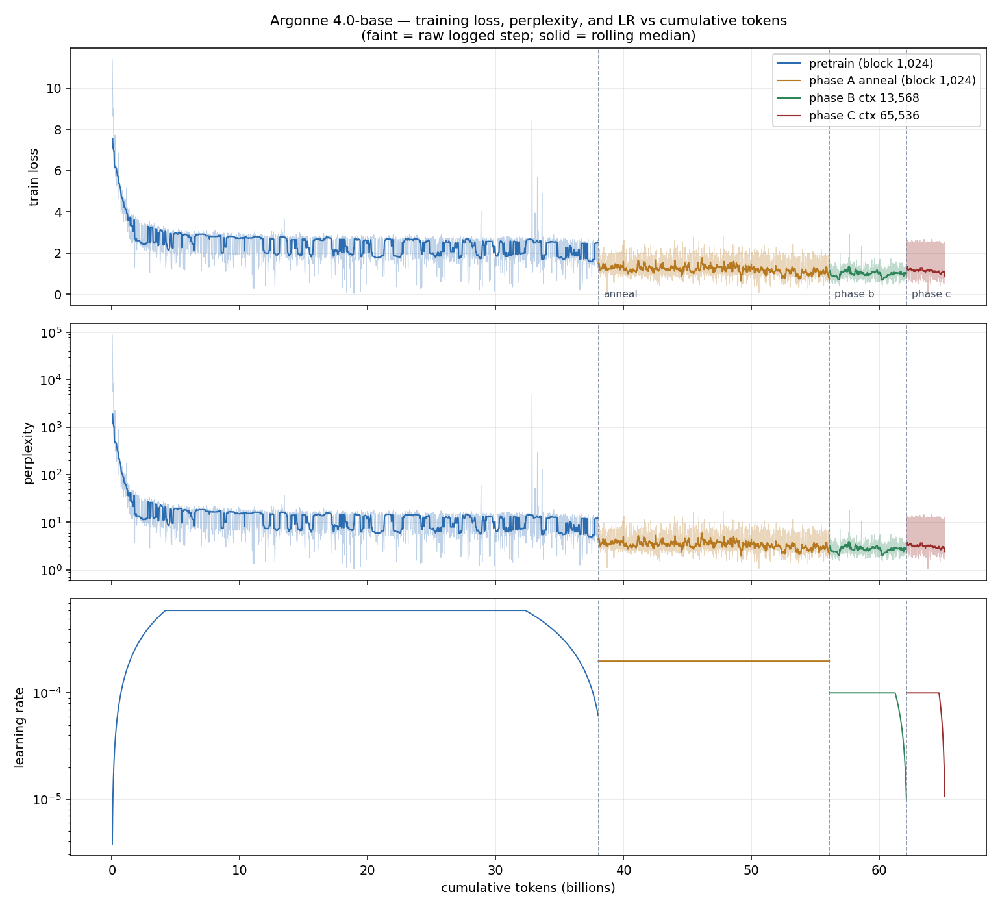

# Argonne LLM Family

Author: Youzhi Yu

Training pipeline and release history for the Argonne causal LM family, trained from scratch on FineWeb-derived web text.

| Model | Params | Context | Training tokens | Hugging Face |
|-------|--------|---------|-----------------|--------------|
| [Argonne 4.0-base](#argonne-40-base) | **1.04B** | **65,536** (trained) | ~65.12B | [argonne-4.0-base](https://huggingface.co/PursuitOfDataScience/argonne-4.0-base) |
| [Argonne 3.5-think](#argonne-35-think) | 2.88B | 13,568 | ~88.84B + post-training | [Argonne-3.5-think](https://huggingface.co/PursuitOfDataScience/Argonne-3.5-think) |
| [Argonne 3.5-base](#argonne-35-base) | 2.88B | **13,568** (trained) | ~88.84B | [argonne-3.5-base](https://huggingface.co/PursuitOfDataScience/argonne-3.5-base) |
| [Argonne 3.0](#argonne-30) | 2.88B | 1,024 (RoPE θ=1e6) | ~76.05B | [argonne-3.0-base](https://huggingface.co/PursuitOfDataScience/argonne-3.0-base) |
| [Argonne 2.5](#argonne-25) | 1.27B | 1,024 | ~76.05B | [Argonne2.5-base](https://huggingface.co/PursuitOfDataScience/Argonne2.5-base) |
| [Argonne 2.0](#argonne-20) | 4.9B | 4,096 | ~21.9B | — (not released) |
| [Argonne 1.5](#argonne-15) | 357M | 2,048 | ~15.45B | [Argonne-1.5](https://huggingface.co/PursuitOfDataScience/Argonne-1.5) |
| [Argonne 1.0](#argonne-10) | 276M | 2,048 | FineWeb-Edu | [Argonne-1.0](https://huggingface.co/PursuitOfDataScience/Argonne-1.0) |

---

# Argonne 4.0-base

Argonne 4.0-base is a **1.04B-parameter** decoder-only transformer with a **trained 65,536-token context**, released as [`PursuitOfDataScience/argonne-4.0-base`](https://huggingface.co/PursuitOfDataScience/argonne-4.0-base). Full model card: [`model_cards/argonne-4.0-base.md`](model_cards/argonne-4.0-base.md).

It is deliberately **smaller** than 3.5-base — 36% of the parameters on 73% of the tokens — and spends those tokens on a math/code-weighted mixture instead of mostly web text. The bet, from a 49-run iso-token campaign, is that at ~1B scale **data composition** outweighs parameter count. Architecture is 3.5's, re-shaped to 1,536 hidden × 32 layers (6 query / 2 KV heads, head_dim 256, SwiGLU 4,096).

## Training loss curve



Four stages. Two easy misreadings: the **sawtooth in stage 1 is the mixture sampler**, not the optimization — each step draws one of the three sources and their entropies differ (edu ≈2.7, math/code ≈1.0–1.5), so consecutive logged steps alternate (faint = raw, solid = rolling median); and loss steps at stage boundaries are **changes of data mixture**, not capability jumps.

## Training details

| Item | Value |
|------|-------|
| **Stages** | Pretrain (`pretrain.py`) → reasoning anneal → ctx extension to 13,568 → ctx extension to 65,536 (`continue_pretrain.py`) |
| **Total optimizer steps** | 112,674 |
| **Tokens processed** | ~65.12B (38.03B pretrain + 18.07B anneal + 6.02B ctx 13,568 + 3.00B ctx 65,536) |
| **Sequence length** | 1,024 (stages 1–2) → 13,568 (stage 3) → **65,536** (stage 4) |
| **Effective batch** | 522,240 → 589,824 → 976,896 → 983,040 tokens/step |
| **Peak learning rate** | 6e-4 pretrain / 2e-4 anneal / 1e-4 both extensions; WSD, 8,000 warmup steps |
| **Optimizer** | AdamW (β₁=0.9, β₂=0.95, weight decay 0.1), grad clip 0.4 |
| **Precision** | FP8 (torchao tensorwise, incl. `lm_head`) under bf16 autocast, chunked CE, `torch.compile`, gradient checkpointing |
| **Hardware** | 3× NVIDIA H100/H200 (DDP) |

**Stage 2 ran at a constant 2e-4 with no cooldown** — the launcher passed `cooldown 0`. That is a defect, not a choice, and it covers 18.07B tokens (28% of the run); it is the most likely place the general-knowledge weakness below originates. Stages 1, 3 and 4 all cooled to 0.1×.

**Attention:** trained with **full causal attention on every layer**, and the released `config.json` says so (`interleaved_local_attention: false`). The 3.0/3.5 configs advertise a 256-token interleaved window, but `model.py` implements it only on the flash-attn-2 path and this cluster runs flash-attn-4 — so the window has never been active in *any* Argonne pretrain. Publishing the flag as-is would hand a window the weights never saw to anyone with flash-attn-2 installed; [`push_model_to_hf.py`](push_model_to_hf.py) now normalizes it out at release time.

## Training data

- Stage 1 — **50 / 30 / 20** [FineWeb-Edu](https://huggingface.co/datasets/HuggingFaceFW/fineweb-edu) / [FineMath-4plus](https://huggingface.co/datasets/HuggingFaceTB/finemath) / GitHub code, sampled **per micro-batch** by `pretrain.py`'s `WeightedMultiLoader` rather than pre-blended, so the ratio is decoupled from raw source sizes (~38.03B tokens, ≈1× per source). Built by [`build_a4_data.py`](build_a4_data.py).
- Stage 2 — code / math / reasoning / tool anneal with a FineWeb-Edu replay tier, built by [`build_reasoning_corpus.py`](build_reasoning_corpus.py) (~18.07B tokens). Measured pool composition: 45.4% code, 24.0% reasoning, 19.9% math, **9.0% general replay**, 1.7% tool.
- Stage 3 — a **disjoint** slice of the same composite, read at 13,568 tokens (~6.02B tokens)
- Stage 4 — 50% long arXiv (docs ≥32,768 tokens, [proof-pile-2](https://huggingface.co/datasets/EleutherAI/proof-pile-2)) / 25% reasoning replay / 25% edu replay, built by [`build_phasec_data.py`](build_phasec_data.py) (3.00B tokens)
- Tokenizer: [Qwen/Qwen3-0.6B-Base](https://huggingface.co/Qwen/Qwen3-0.6B-Base) (151,669-token vocab)

## Benchmarks — measured on the released weights

lm-eval via a vLLM backend that is token-for-token validated against `model.py` on this architecture. `acc_norm` for the MC tasks, `acc` for winogrande/mmlu, gsm8k separately. Both anchors are 1B-class and were scored on the **same harness, tasks and few-shot counts** in the same campaign. Regenerate with [`reasoning/release_table.py`](reasoning/release_table.py).

| task | **Argonne 4.0-base** | stage 3 (ctx 13,568) | Llama-3.2-1B | Qwen3-0.6B-Base |
|---|---:|---:|---:|---:|
| arc_challenge | **36.26** | 35.75 | 34.90 | 44.88 |
| arc_easy | 56.19 | 54.88 | 59.93 | 57.87 |
| hellaswag | 45.44 | 43.85 | 60.36 | 53.61 |
| piqa | 67.74 | 67.08 | 73.50 | 69.80 |
| sciq | 79.80 | 77.80 | 89.90 | 91.30 |
| openbookqa | 31.80 | 32.20 | 36.20 | 34.60 |
| winogrande *(acc)* | 55.49 | 56.35 | 61.96 | 60.22 |
| **mmlu** *(acc)* | **26.15** | 24.73 | 31.41 | **52.49** |
| **8-task mean** | **49.86** | **49.08** | **56.02** | **58.10** |
| **gsm8k strict-match** | **7.51** | **9.70** | **1.82** | **49.28** |
| gsm8k flexible-extract | 7.88 | 10.16 | 2.27 | 50.04 |

Params / tokens: **4.0-base 1.04B / 65.12B** · Llama-3.2-1B 1.24B / ~9T · Qwen3-0.6B-Base 0.6B / ~36T — i.e. 0.7% of Llama's and 0.2% of Qwen's token budget, so a deficit is expected; its size and shape are the finding.

- **The data bet pays off against Llama-3.2-1B where it was supposed to:** generative math **7.51 vs 1.82 (4.1×)** at 84% of the parameters. It loses the commonsense/knowledge tasks.
- **Against Qwen3-0.6B-Base it is behind on all nine cells** — −8.24 mean, **−26.34 mmlu**, **−41.77 gsm8k** — at 1.7× the parameters. Tokenizer is not a confound (4.0 pretrains with Qwen3's). **MMLU at 26.15 against 25.0 chance is this model's real weakness**, and the two levers this recipe left on the table are the 9% general replay tier and stage 2's missing cooldown.
- **Stage 4 was a domain trade, not a free context extension:** +0.78 MC mean and the whole 65,536 window, against **−2.19 gsm8k** — the only generative task — plus worse held-out CE on 7 of 8 reasoning tiers (`reason_r1` +69% PPL). Detail in [`reasoning/thinking_training.md`](reasoning/thinking_training.md) §39.
- Finishing the LR cooldown (262 steps, 0.26B tokens past §39's mid-cooldown reading) **moved nothing**: 49.86 vs 49.94 mean, 26.15 vs 25.95 mmlu.

**The internal two-axis base gate disagrees, and the gate is wrong.** It rates the released weights **17/20 math · 14/15 general** (pooled 34/40 · 28/30, CLEARED) — *ahead* of the 2.88B base behind Argonne-3.5-think (14/20 · 14/15) at 36% of the parameters — while blind to a 2× MMLU and 6.6× gsm8k gap. The general axis has a ceiling of 15 and every a4 checkpoint tested reads 14–15 on it; two phase-C checkpoints 40 steps apart differ by the probe's own ±2-item noise floor. **A saturating gate cannot rank bases; it can only reject very bad ones.** Reproduce with [`reasoning/a4_gate_probe.py`](reasoning/a4_gate_probe.py).

## The 65,536-token context is trained, not extrapolated

RoPE θ=1e6 does **not** extrapolate unaided on this architecture. All three arms scored on the **same 24 held-out windows** of 49,152 tokens from proof-pile-2 arXiv shards stage 4 did not train on. Nats/token, lower is better:

| Token position | stage 2 (ctx 1,024) | stage 3 (ctx 13,568) | **Argonne 4.0-base** (ctx 65,536) |
|---|---:|---:|---:|
| 0 – 1,024 | 2.561 | 2.401 | **1.970** |
| 1,024 – 2,048 | 5.086 | 2.061 | **1.671** |
| 4,096 – 8,192 | 6.051 | 1.427 | **1.139** |
| 8,192 – 13,568 | 5.964 | 1.242 | **0.980** |
| 13,568 – 20,480 | 5.920 | 1.197 | **0.924** |
| 24,576 – 32,768 | 5.990 | 1.198 | **0.864** |
| 40,960 – 49,152 | 6.075 | 1.300 | **0.820** |

Stage 2 is coherent inside its 1,024-token window and **flat at ~6 nats for the next 48,000 tokens** — the counterexample to "a large RoPE base buys free context", measured on this model's own ancestor. The release falls monotonically with position and pays no short-context tax.

**But the stage 3 → 4.0-base gain is not context extension.** The probe's falsifiable test says a real extension makes the gap *grow* with position; instead it is **U-shaped** — −0.43 nats at 0–1,024, −0.26 at the minimum, −0.48 in the 40,960–49,152 tail. It is as large at position 0 as at position 49,000, and stage 4 did not need to extend position 0–1,024. With stage 4 also making 7 of 8 reasoning tiers worse, the honest attribution is **distribution (toward arXiv), not length**. The extension proper is stage 3's. Reproduce with [`reasoning/exp_longctx_learning.py`](reasoning/exp_longctx_learning.py).

---

# Argonne 3.5-think

The reasoning model of the 3.5 line, released as [`PursuitOfDataScience/Argonne-3.5-think`](https://huggingface.co/PursuitOfDataScience/Argonne-3.5-think). Built on [argonne-3.5-base](https://huggingface.co/PursuitOfDataScience/argonne-3.5-base); emits an explicit `<think>…</think>` trace then a `\boxed{}` answer.

## Revision 2026-08-04 — retrained on uncorrupted data

**The first release was trained on a corrupted view of its own data.** Two argparse defaults in [`reasoning/cot-sft.py`](reasoning/cot-sft.py) — `--max_think_tokens 128` and `--preserve_raw_reasoning 0` — silently truncated reasoning traces mid-derivation and dropped rows: ~a third of the chain-of-thought tokens, 80.7% of the arithmetic drill tier, and the concluding sentence of most targets. No launcher passed these flags, so every earlier run inherited them.

Fixing the two defaults — **no new data, no new method, same recipe** — produced the current release:

| greedy, paired on identical items | first release | **current** | delta | |
|---|---:|---:|---:|---|
| ASDiv (n=1000) | 70.40 | **74.90** | +4.50 | p<0.01 |
| SVAMP (n=1000) | 64.50 | **69.60** | +5.10 | p<0.01 |
| MAWPS (n=500) | 57.00 | **61.20** | +4.20 | p<0.05 |
| GSM-Plus (n=500) | 28.00 | **42.00** | **+14.00** | p<1e-9 |
| MATH-500 (n=319) | 31.66 | **39.18** | +7.52 | p<0.05 |
| **five-set mean** | **50.31** | **57.38** | **+7.07** | |
| one-step arithmetic (144 items) | 80/144 (55.6%) | **143/144 (99.3%)** | **+43.7** | |
| lm-eval 6-task (`acc_norm`) | 55.21 | 54.87 | −0.34 | flat |
| instruction probe (14 items) | 13/14 | 13/14 | — | |

Single-step arithmetic is the headline: the first release answered `a op b` wrong about half the time — its own model card documented computing `17−5=12` and then subtracting 5 again to answer 7 — which was the truncated-data defect showing through. **Replicated at three seeds** before release (five-set 57.25 / 57.35 / 57.38, spread 0.13pt; arithmetic 142/143/144 of 144). Significance is exact McNemar on paired outcomes.

GSM-Plus is perturbed GSM8K *test*, so it was audited directly: the training mix's GSM8K tier is 4,338/4,338 from the **train** split with zero test items, and no judged GSM-Plus item exceeds Jaccard 0.60 against any training row. **MATH-500 does carry measured leakage** (17 of 319 items have a near-duplicate in the mix); re-scored on the 302 clean items the current model gets 39.07 vs the first release's 31.46, so the gap is unchanged. Audit tool: [`reasoning/pool_decontam.py`](reasoning/pool_decontam.py). Full diagnosis, fix and gate: [`reasoning/thinking_training.md`](reasoning/thinking_training.md) §34–§37.

## vs Argonne 3.0-think (measured on the first release)


Both models measured in a **single job**, same grader, same n=300 / K=8 / seed — not compared against previously-recorded numbers.

| clean, n=300, K=8 | Argonne 3.0-think | **Argonne 3.5-think** | delta |
|---|---|---|---|
| SVAMP greedy | 22.00 | **65.00** | **+43.0** |
| SVAMP self-consistency | 30.00 | **74.00** | **+44.0** |
| SVAMP pass@8 | 51.33 | **90.67** | +39.3 |
| ASDiv greedy | 32.33 | **73.00** | **+40.7** |
| ASDiv self-consistency | 39.33 | **82.67** | **+43.3** |
| ASDiv pass@8 | 60.00 | **92.33** | +32.3 |

Judged on **SVAMP/ASDiv**, which appear in no training stage of this line. **GSM8K is contaminated** for Argonne reasoning models and is never reported.

## The mechanism: termination


The defining failure of the 3.0 line was non-termination — traces that never closed `</think>`, so no answer was emitted. Training only on short, closed, correct traces makes termination a property of the weights: `no_answer` falls 53.7% → 1.3% (SVAMP) and 59.7% → 2.0% (ASDiv), and budget-forcing — previously the only thing that helped — now adds ~1 point.

## What actually moved the number


The base raises the **ceiling** (pass@8 58.7 → 74.0) while greedy stays flat; the short-trace mix converts that ceiling into a **floor** (+36.7 greedy); SFT breadth via the weight soup adds the last ~2 points. No RL, no distillation from a stronger teacher.

## Recipe

| stage | data | detail |
|---|---|---|
| 1 — SFT | UltraChat 200k | 207,865 rows, 1 epoch, effective batch 20 |
| 2 — DPO | argilla/dpo-mix-7k | 6,750 pairs, LR 1e-6, β=0.03 |
| 3 — CoT-SFT | short-trace mix, 28,428 rows all ≤768 tokens | 1 epoch, effective batch 12, **traces preserved whole** |
| 4 — weight soup | — | 0.85 × CoT + 0.15 × DPO |

Relative to the first release, stage 3 differs in exactly two ways: reasoning traces are kept whole instead of being cut at 128 tokens, and 2,000 rows of general-instruction anchor were added back. The second part matters — restoring the traces alone costs instruction-following (13/14 → 10/14); with the anchor restored it holds at 13/14 at every seed.

α = 0.85 is a measured knee, not a default: α = 0.70 reintroduces non-termination. Full build log, including the ablations that failed and the predictions that turned out wrong, is in [`reasoning/thinking_training.md`](reasoning/thinking_training.md) — §32 for the original recipe, §34–§37 for the data-corruption diagnosis, the fix, and this release's gate.

---

# Argonne 3.5-base

Argonne 3.5-base is a 2.88B-parameter decoder-only transformer, released as [`PursuitOfDataScience/argonne-3.5-base`](https://huggingface.co/PursuitOfDataScience/argonne-3.5-base). Same architecture as Argonne 3.0; what changed is the training recipe and a three-stage data curriculum that ends in a **trained** 13,568-token context.

## Training loss curve


Loss, perplexity, and LR against cumulative tokens across all three stages. The step down at each stage boundary is a change of data mixture, not a capability jump — the anneal and context-extension corpora are intrinsically lower-entropy than FineWeb, so cross-stage loss values are not comparable.

## Training details

| Item | Value |
|------|-------|
| **Stages** | Pretrain (`pretrain.py`) → reasoning anneal (`continue_pretrain.py`) → context extension (`continue_pretrain.py`) |
| **Total optimizer steps** | 321,062 |
| **Tokens processed** | ~88.84B (65.30B pretrain + 17.50B anneal + 6.02B context extension) |
| **Sequence length** | 1,024 (stages 1–2) → **13,568** (stage 3) |
| **Effective batch** | 233,472 → 270,336 tokens/step (stages 1–2); 488,448 tokens/step (stage 3) |
| **Peak learning rate** | 6e-4 pretrain / 2e-4 anneal / 1e-4 context extension; WSD, 8,000 warmup steps, cooldown to 0.1× in every stage |
| **Optimizer** | AdamW (β₁=0.9, β₂=0.95, weight decay 0.1), grad clip 0.4 |
| **Precision** | FP8 (torchao tensorwise, incl. `lm_head`) under bf16 autocast, `torch.compile`, gradient checkpointing |
| **Final train loss** | 0.8923 (stage-3 slice average) |
| **Hardware** | 3× NVIDIA H100/H200 (DDP) |

Recipe changes vs 3.0: a real LR cooldown in every stage (3.0 ran the WSD stable phase with `cooldown = 0`), a higher peak LR (6e-4 vs 3e-4), a longer warmup (8,000 vs 1,000), tighter gradient clipping (0.4 vs 1.0), and FP8 matmuls. The tighter clip plus QK-norm are what make the higher LR stable.

## Training data

- Stage 1 — [FineWeb](https://huggingface.co/datasets/HuggingFaceFW/fineweb) + [FineMath](https://huggingface.co/datasets/HuggingFaceTB/finemath), 85/15 (~65.30B tokens)
- Stage 2 — code / math / reasoning / tool anneal with a FineWeb-Edu general-replay tier, built by [`build_reasoning_corpus.py`](build_reasoning_corpus.py) (~17.50B tokens)
- Stage 3 — a **disjoint** slice of the same composite, read at 13,568 tokens (~6.02B tokens)
- Tokenizer: [Qwen/Qwen3-0.6B-Base](https://huggingface.co/Qwen/Qwen3-0.6B-Base) (151,669-token vocab)

## Context extension is trained, not extrapolated

RoPE θ=1e6 does **not** extrapolate unaided on this architecture. Position-bucketed NLL on held-out arXiv, comparing the stage-2 checkpoint against the final weights it seeded (lower is better):

| Token position | Stage 2 (ctx 1,024) | Argonne 3.5-base (ctx 13,568) |
|---|---|---|
| 0 – 1,024 | 2.194 | **2.161** |
| 1,024 – 2,048 | 5.536 | **1.860** |
| 4,096 – 8,192 | 5.895 | **1.320** |
| 8,192 – 13,568 | 5.961 | **1.207** |
| 13,568 – 20,480 | 5.965 | **1.122** |
| 20,480 – 24,576 | 5.938 | **1.096** |

The stage-2 model is coherent inside its 1,024-token window and effectively blind past it. The final model improves monotonically with position, keeps improving *beyond* its own 13,568 training length, and pays no short-context tax (the 0–1,024 control bucket is better than stage 2). Reproduce with [`reasoning/exp_longctx_learning.py`](reasoning/exp_longctx_learning.py).

## Base gate

A 35-item greedy few-shot probe (20 math, 15 world-knowledge) used as a go/no-go gate on whether a base is worth a reasoning recipe — **not** a capability benchmark (n is small, it saturates, and it has a measured ±2-item noise floor).

| Checkpoint | Math /20 | General /15 |
|---|---|---|
| Stage 2 (step 308,733) | 18 | 15 |
| step 320,885 | 18 | 15 |
| step 321,054 | 17 | 15 |
| step 321,062 (released) | 18 | 15 |

Both axes clear the ≥14/20 ∧ ≥14/15 gate, and context extension cost nothing on either. Reproduce with [`reasoning/probe_pretrain_ckpt.py`](reasoning/probe_pretrain_ckpt.py). No standard held-out benchmark suite has been run on this checkpoint yet.

---

# Argonne 3.0

Argonne 3.0-base is a 2.88B-parameter decoder-only transformer, released as [`PursuitOfDataScience/argonne-3.0-base`](https://huggingface.co/PursuitOfDataScience/argonne-3.0-base). It combines grouped-query attention with stability-oriented additions: QK-norm, V-norm, sandwich norms, interleaved local/global attention, and a final logit softcap.

## Training loss curve


## Model architecture

| Component | Specification |
|-----------|---------------|
| **Parameters** | 2,882,162,688 (~2.88B) |
| **Layers** | 24 transformer blocks |
| **Hidden size** | 3,072 |
| **Attention heads** | 12 query / 4 key-value (GQA) |
| **Head dimension** | 256 |
| **Feed-forward** | SwiGLU MLP, 8,192 intermediate dim |
| **Attention pattern** | Interleaved local/global causal attention (window 256, every other layer) |
| **Normalization** | RMSNorm with QK / V / sandwich norms |
| **Position encoding** | RoPE (θ = 1,000,000) |
| **Logit stabilization** | Final logit softcap = 15.0 |
| **Context length** | 1,024 tokens |
| **Vocabulary size** | 151,669 (Qwen3 tokenizer) |
| **Tied embeddings** | Yes (input ↔ output) |

## Training details

| Item | Value |
|------|-------|
| **Stages** | Pretrain (`pretrain.py`) → continued pretrain (`continue_pretrain.py`) |
| **Total optimizer steps** | 329,148 |
| **Tokens processed** | ~76.05B (20.84B stage 1 + 55.21B stage 2, one epoch each) |
| **Sequence length** | 1,024 |
| **Effective batch** | 233,472 tokens/step (38 per GPU × grad accum 2 × 3 GPUs) |
| **Peak learning rate** | 3e-4, WSD schedule, 1,000 warmup steps, min LR ratio 0.1 |
| **Optimizer** | AdamW (β₁=0.9, β₂=0.95, weight decay 0.1), grad clip 1.0 |
| **Precision** | bf16 autocast, `torch.compile`, gradient checkpointing |
| **Final train loss** | 2.5168 |
| **Hardware** | 3× NVIDIA H200 (DDP) |

## Training data

- Stage 1: FineWeb shard (~20.84B tokens)
- Stage 2: FineWeb CC-MAIN-2025-21 dump (~55.21B tokens)
- Tokenizer: [Qwen/Qwen3-0.6B-Base](https://huggingface.co/Qwen/Qwen3-0.6B-Base) (151,669-token vocab)

---

# Argonne 2.5

Argonne 2.5 is a 1.27B-parameter pretraining checkpoint, released as [`PursuitOfDataScience/Argonne2.5-base`](https://huggingface.co/PursuitOfDataScience/Argonne2.5-base).

## Training loss curve


## Model architecture

| Component | Specification |
|-----------|--------------|
| **Parameters** | 1,273,807,360 (~1.27B) |
| **Layers** | 28 transformer blocks |
| **Hidden size** | 1,792 |
| **Attention heads** | 14 query / 7 key-value (GQA) |
| **Head dimension** | 128 |
| **Feed-forward** | SwiGLU MLP, 4,864 intermediate dim |
| **Context length** | 1,024 tokens |
| **Vocabulary size** | 151,669 |
| **Normalization** | RMSNorm (ε = 1e-6) |
| **Position encoding** | RoPE (θ = 10,000) |

## Training details

| Item | Value |
|------|-------|
| **Total steps** | 425,975 |
| **Tokens processed** | ~76.05B |
| **Final train loss** | 2.6119 |
| **Sequence length** | 1,024 |
| **Effective batch** | 245,760 tokens (20 per GPU × grad accum 4 × 3 GPUs) |
| **Learning rate** | 3e-4, min LR ratio 0.1, 1,000 warmup steps |
| **Precision** | bf16 autocast, `torch.compile` |
| **Hardware** | 3× H200 (DDP) |

## Training data

- FineWeb and FineWeb-Edu
- Final stage training shard: 55.2B tokens; cumulative across the full run: 76.05B tokens

---

# Argonne 2.0

A 4.9B-parameter decoder-only transformer trained from scratch with a custom tensor-parallel implementation on a single DGX A100 node. Not released on Hugging Face.

## Training loss curve


## Model architecture

| Component | Specification |
|-----------|--------------|
| **Parameters** | 4,918,072,800 (~4.9B) |
| **Layers** | 24 transformer blocks |
| **Hidden size** | 4,080 |
| **Attention heads** | 24 query / 8 key-value (GQA) |
| **Head dimension** | 170 |
| **Feed-forward** | SwiGLU MLP, ~10,880 intermediate dim |
| **Context length** | 4,096 tokens |
| **Vocabulary size** | 151,665 (Qwen2.5-3B-Instruct tokenizer) |
| **Normalization** | RMSNorm (ε = 1e-6) |
| **Position encoding** | RoPE |

## Training details

| Item | Value |
|------|-------|
| **Total steps** | 1,347,890 |
| **Tokens processed** | ~21.9B |
| **Final loss** | ~2.5–3.5 |
| **Learning rate** | 1e-4 peak → 1e-5 (cosine), 2,000 warmup steps |
| **Optimizer** | AdamW (fused), weight decay 0.1, grad clip 1.0 |
| **Parallelism** | Tensor parallelism across 8 GPUs (sharded attention + MLP, replicated embeddings/norms, async all-reduce) |
| **Hardware** | 1× DGX A100 (8× A100 80GB, NVLink) |

## Training data

FineWeb (CC-MAIN-2025-26): 250 parquet shards streamed sequentially, documents tokenized with BOS/EOS boundaries, quality-filtered, chunked into 4,096-token sequences.

---

# Argonne 1.5

A 357M-parameter model, released as [`PursuitOfDataScience/Argonne-1.5`](https://huggingface.co/PursuitOfDataScience/Argonne-1.5).

## Training loss curve


## Improvements over Argonne 1.0

- `torch.compile` for pretraining speed; flash attention for ~2.6× memory efficiency (larger batches)
- More layers and attention heads; more efficient GPU utilization
- Integrated with the Hugging Face `AutoModel` class; better text-generation support

## Model and training

| Item | Value |
|------|-------|
| **Parameters** | 356,516,640 (~357M) |
| **Config** | 16 layers, 16 heads, 1,296 hidden, 2,048 context |
| **Tokens processed** | 15,453,927,424 (~15.45B, same data as 1.0) |
| **Total steps** | 80,000 |
| **Batch size** | 756 |
| **Training cost** | 1,248 GPU hours on 1 DGX node (8× A100 80GB) |

---

# Argonne 1.0

The first Argonne model: 276M parameters, released as [`PursuitOfDataScience/Argonne-1.0`](https://huggingface.co/PursuitOfDataScience/Argonne-1.0). See the [model card](https://huggingface.co/PursuitOfDataScience/Argonne-1.0#inference) for inference details.

## Training loss curve


## Model and training

| Item | Value |
|------|-------|
| **Parameters** | 275,827,680 (~276M) |
| **Config** | 12 layers, 12 heads, 1,296 hidden, 2,048 context, dropout 0.1 |
| **Data** | [FineWeb-Edu (CC-MAIN-2024-10)](https://huggingface.co/datasets/HuggingFaceFW/fineweb-edu) |
| **Learning rate** | 3e-5 until step 62,000, then 5e-5 (batch 48 → 60 at the same step) |
| **Total steps** | 160,000 |
| **Training cost** | 1,440 GPU hours on 1 DGX node (8× A100 80GB) |

---

# Argonne LLM Training

Distributed PyTorch training pipeline for the Argonne causal LM using Qwen-family tokenizers and llm.c-style binary token data.

## Pipeline stages

```text
preprocess_data.py        parquet -> train.bin token shards
pretrain.py               stage 1: DDP pretraining from scratch
continue_pretrain.py      stage 2: continued pretraining on new data
midtraining.py            stage 3: long-context midtraining (FSDP/DDP, e.g. 13,568 ctx)
sft.py                    stage 4: supervised fine-tuning (chat data, e.g. UltraChat)
dpo.py                    stage 5: direct preference optimization
cot-sft.py                stage 6: chain-of-thought SFT (reasoning / <think> models)
```

## Project layout

```text
ArgonneAI/
├── model.py                 # ArgonneModel/ArgonneConfig + HF registration (model_type="argonne2")
├── pretrain.py              # Main DDP pretraining script
├── continue_pretrain.py     # Continued pretraining (new-data continuation)
├── midtraining.py           # Long-context midtraining (FSDP support)
├── sft.py                   # Supervised fine-tuning
├── dpo.py                   # DPO preference tuning
├── cot-sft.py               # Chain-of-thought SFT (HF Trainer-based)
├── preprocess_data.py       # Parquet -> train.bin converter
├── inference.py             # Text generation from a checkpoint or HF repo
├── push_model_to_hf.py      # Publish checkpoints to Hugging Face
└── eval_sft_quality.py      # SFT quality probes
```

## Checkpointing and outputs

- Checkpoints are written as `checkpoint_step_<N>.pt`, including model/optimizer/scheduler state, `global_step`, `tokens_processed`, and data position.
- On periodic checkpoints, rank 0 prints a sampled generation.
- At end of run, scripts save a final checkpoint plus `final_model/` (weights, tokenizer, config via `save_pretrained`).
- Wall-clock-aware training (`--wall_time`) saves and exits cleanly before SLURM time limits, enabling auto-resubmit slice chains.

## Model notes (`model.py`)

- Hugging Face-compatible (`ArgonneConfig`, `ArgonneModel`), registered for `AutoConfig`, `AutoModel`, and `AutoModelForCausalLM`; `from_pretrained` self-heals rotary buffers and the embedding tie after loading.
- GQA, SwiGLU MLP, RMSNorm (+ QK/V/sandwich norms), RoPE, interleaved local/global attention, final logit softcap.
- Attention path selection: FlashAttention 2 (if available) → PyTorch SDPA → math fallback; the active path is logged once at startup.
- Training preset used by `pretrain.py` / `continue_pretrain.py` (Argonne 3 architecture): hidden size 3,072, 24 layers, 12 query heads, 4 KV heads, `max_position_embeddings = --block_size`.
